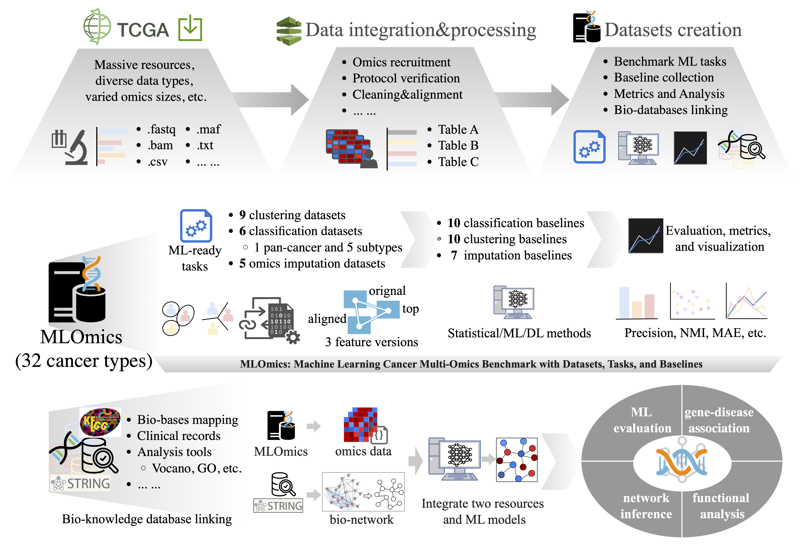

<div  align="center">    

</div>

<!-- 


 -->


- [MLOmics: Benchmark for Machine Learning on Cancer Multi-Omics Data](#mlomics-machine-learning-cancer-multi-omics-benchmark-with-datasets-tasks-and-baselines)

  - [Installations](#installations)
  - [Quick Start](#quick-start)
  - [Datasets](#datasets)
  - [Tasks \& Baselines](#tasks--baselines)
  - [Performance Leaderboards](#performance-leaderboards)
      - [Classification Results](#classification-results)
      - [Imputation Results](#imputatiopn-results)
  <!-- - [Folder Structure](#folder-structure)
  - [How to Contribute](#how-to-contribute) -->
  <!-- - [Authors \& Acknowledgements](#authors--acknowledgements) -->
  <!-- - [Contact](#contact) -->
  - [References](#references)


-------------------

# *MLOmics*: Benchmark for Machine Learning on Cancer Multi-Omics Data


Framing the investigation of diverse cancers as a machine learning problem has recently shown significant potential in multi-omics analysis and cancer research.
Empowering these successful machine learning models are the high-quality training datasets with sufficient data volume and adequate preprocessing.
MLOmics is an open cancer multi-omics benchmark aiming at serving better the development and evaluation of bioinformatics and machine learning models.
MLOmics contains 8,314 patient samples covering all 32 cancer types with four omics types, stratified features, and extensive baselines.
Complementary support for downstream analysis and bio-knowledge linking are also included to support interdisciplinary analysis. 

<!-- ## 1. Citation

Our spaper "MLOmics: Large-Scale Cancer Multi-Omics Benchmark with Open Datasets, Tasks, and Baselines" has been accepted    and released on arxiv [\[PDF\]](http: .pdf). 
If you find *MLOmics* helpful, we would appreciate citations to the following paper:

```
@article{
}
```

or:

```
. (2024). MLOmics: Large-Scale Cancer Multi-Omics Benchmark with Open Datasets, Tasks, and Baselines
``` -->


## Installations

### Step 1. Clone the repository:
```bash
$ git clone https://github.com/chenzRG/Cancer-Multi-Omics-Benchmark
$ cd Cancer-Multi-Omics-Benchmark
```

### Step 2. Set up the environment:
```bash
# Set up the environment
conda create -n mlomics python=3.9
conda activate 
```

### Step 3. Install requirements:
```bash
pip install -r requirements.txt
```

### Step 4. Download datasets:
```bash
# Please make sure git-lfs is installed when downloading from HuggingFace.
$ ./download.sh

# Alternatively, you can download the dataset from figshare: https://figshare.com/articles/dataset/MLOmics_Cancer_Multi-Omics_Database_for_Machine_Learning/28729127
```


## Repository Structure
```
MLOmics/
├── Main_Dataset                     # Main Datasets
├── Baseline_and_Metric/             # Baseline & Metrics
│   └── Tasks/
│       ├── Baselines/   
│       │   ├── R/                   # Traditional ML models (.r files)
│       │   └── Python/              # Deep learning models (.py files)
│       └── Metrics/
│           └── task_metrics.py      # Evaluation metrics for each task
├── Dwonstream_Analysis_Tools_and_resources/                     
│   ├── Knowledge_bases/             # Biological knowledge bases
│   │   ├── STRING_mapping.csv       # STRING database mapping
│   │   └── KEGG_mapping.csv         # KEGG pathway mapping
│   ├── Clinical_annotation/         # Patient clinical data
│   │   └── clinical_record.csv      
│   └── Analysis_tools/              # Analysis scripts
│       └── Analysis_Tools_and_Resources.py
└── Scripts/                         # Quick start scripts
    ├── Tasks/       
    └── Dwonstream_Analysis               
```

## Dataset Usage

Each dataset is available in three feature versions:
- Original: Full feature set
- Aligned: Intersection of features across cancer types
- Top: Most significant features selected via ANOVA

## Quick Start

MLOmics provides a standardized interface to run all baseline models:
```bash
$ ./<baseline_model>.sh <dataset> <version> [options]
```

Where:
- <baseline_model>: Name of the model script (e.g., GRAPE.sh, Subtype-GAN.sh)
- <dataset>: Target dataset name (e.g., GS-BRCA, ACC)
- <version>: feature version name (e.g., Original, Aligned, Top)
- [options]: Optional parameters like missing rate (e.g., 0.3)

### 1. Running Baselines

Clustering Tasks:
```bash
# Run clustering with Subtype-GAN model on ACC Top data
$ cd Scripts/Clustering
$ ./Subtype-GAN.sh ACC Top
```

Imputation Tasks:
```bash
# Run imputation with GAIN model on 30% missing BRCA CNV data
$ cd Scripts/Imputation
$ ./GAIN.sh BRCA CNV 0.3 
```


Classification Tasks:
```bash
# Run classification with DeepCC model on GS-BRCA Original data
$ cd Scripts/Classification
$ ./DeepCC.sh GS-BRCA original
```

### 2. Downstream Analysis
MLOmics provides comprehensive tools for biological interpretation of machine learning results, primarily focused on differential expression analysis and pathway enrichment.

KEGG pathway analysis:
```bash
$ cd Scripts/Dwonstream_Analysis
$ ./pwanalysis.sh <clustering_log_path> [options]
  --p_value_cutoff 0.05       # Significance threshold for genes
```

Generate volcano plot:
```bash
$ cd Scripts/Dwonstream_Analysis
$ ./volcano.sh <clustering_log_path> [options]
  --p_value_threshold 0.05     # P-value significance threshold
```

## Datasets

### Summary

MLOmics provides a collection of 20 multi-omics datasets including:

- **One pan-cancer dataset** involving patients with 32 cancer types.
- **Nine unlabeled cancer subtype datasets** including Adrenocortical Carcinoma (ACC), Kidney Renal Papillary Cell Carcinoma (KIRP), Kidney Renal Clear Cell Carcinoma (KIRC), Liver Hepatocellular Carcinoma (LIHC), Lung Adenocarcinoma (LUAD), Lung Squamous Cell Carcinoma (LUSC), Prostate Adenocarcinoma (PRAD), Thyroid Carcinoma (THCA), and Thymoma (THYM).
- **Five labeled, golden-standard subtype datasets** corresponding to five cancers: Colon Adenocarcinoma (GS-COAD), Breast invasive carcinoma (GS-BRCA), Glioblastoma Multiforme (GS-GBM), Brain Lower Grade Glioma (GS-LGG), and Ovarian Serous Cystadenocarcinoma (GS-OV).
- **Five TCGA data imputation datasets** include corrupted omics profiles from the above well-studied cancer types involving Imp-COAD, Imp-BRCA, Imp-GBM, Imp-LGG, and Imp-OV.
- **Two complementary data resources** include a collected corpus from STRING and a collection of Electronic Health Records (EHR) data for cancer samples, accompanied by interactive scripts for integration.

### Multiple-Scaled Feature

Cancer multi-omics analysis always suffers from an unbalanced sample and feature size. MLOmics hence provides three versions of feature scales, i.e., **Original**, **Top**, and **Aligned**, to support feasible analysis.
- **Original features** are extracted directly from each dataset and correspond to the complete set of features without filtering. Users can customize their datasets.
- **Top features** are identified through ANOVA statistical testing according to p-values, selecting the most significant features among samples. This approach unifies the feature size and potentially reduces the noise features.
- **Aligned features** are determined by the intersection of features present across all sub-datasets, corresponding to the shared features among different sub-datasets.


### Datasets

MLOmics provides a collection of 20 multi-omics datasets covering 32 cancer types, that is, one Pan-cancer dataset, nine unlabeled cancer subtype datasets, five labeled, golden-standard subtype datasets, and five TCGA data imputation datasets.

| Dataset     | Feature Scale | mRNA  | miRNA | Methy | CNV   | Sample Size | #Baselines | Learning Task    |
|-------------|----------------|-------|-------|-------|-------|-------------|------------|------------------|
| ACC         | Original       | 18034 | 368   | 19045 | 19525 | 177         | 10         | Clustering       |
| KIRP        | Original       | 18465 | 769   | 18715 | 19551 | 273         | 10         | Clustering       |
| KIRC        | Original       | 18464 | 352   | 19045 | 19523 | 314         | 10         | Clustering       |
| LIHC        | Original       | 17946 | 846   | 18714 | 19551 | 364         | 10         | Clustering       |
| LUAD        | Original       | 18310 | 427   | 19052 | 19551 | 450         | 10         | Clustering       |
| LUSC        | Original       | 18206 | 423   | 19060 | 19551 | 363         | 10         | Clustering       |
| PRAD        | Original       | 17954 | 759   | 19049 | 19568 | 450         | 10         | Clustering       |
| THCA        | Original       | 17261 | 375   | 19052 | 19551 | 291         | 10         | Clustering       |
| THYM        | Original       | 18354 | 1018  | 18716 | 19551 | 119         | 10         | Clustering       |
| Pan-cancer  | Aligned        | 3217  | 383   | 3139  | 3105  | 8314        | 10         | Classification   |
| GS-COAD     | Original       | 17261 | 375   | 19052 | 19551 | 260         | 10         | Classification   |
| GS-BRCA     | Original       | 18206 | 368   | 19049 | 19568 | 671         | 10         | Classification   |
| GS-GBM      | Original       | 20684 | 335   | 19034 | 19545 | 243         | 10         | Classification   |
| GS-LGG      | Original       | 18345 | 345   | 19023 | 19534 | 246         | 10         | Classification   |
| GS-OV       | Original       | 17354 | 244   | 19034 | 19534 | 284         | 10         | Classification   |
| Imp-COAD    | Top            | 2000  | 200   | 2000  | 2000  | 260         | 7          | Imputation       |
| Imp-BRCA    | Top            | 2000  | 200   | 2000  | 2000  | 671         | 7          | Imputation       |
| Imp-GBM     | Top            | 2000  | 200   | 2000  | 2000  | 243         | 7          | Imputation       |
| Imp-LGG     | Top            | 2000  | 200   | 2000  | 2000  | 246         | 7          | Imputation       |
| Imp-OV      | Top            | 2000  | 200   | 2000  | 2000  | 284         | 7          | Imputation       |


## Task \& Baselines
MLOmics currently provides 20 learning tasks in three studies, including pan-cancer classification, cancer subtype identification, and omics data imputation, each with a corresponding dataset version, baseline methods, and evaluation metrics.

### Pan-cancer Classification

**Motivation:**  
This task aims to identify the specific cancer type for each patient, enhancing early diagnostic accuracy and potentially improving treatment outcomes.

**Baseline Methods:**  
Several computational multi-omics data integration methods have been proposed for cancer identification using classical statistical machine learning and deep-based methods. Currently, we have enrolled well-used, open-sourced statistical methods, including:

- **Similarity Network Fusion (SNF) [1]:** Integrates omics data by iteratively refining sample similarity networks and applying spectral clustering.
- **Neighborhood-based Multi-Omics clustering (NEMO) [2]:** Converts sample similarity networks to relative similarity for group comparability.
- **Cancer Integration via Multi-kernel Learning (CIMLR) [3]:** Combines various Gaussian kernels into a similarity matrix for clustering.
- **iClusterBayes [4]:** Projects input into a low-dimensional space using the Bayesian latent variable regression model for clustering.
- **moCluster [5]:** Uses multiple multivariate analyses to calculate latent variables for classification.
- **Subtype-GAN [6] :** Extracts features from each omics data by relatively independent GAN layers and integrates them.
- **DCAP [7] :** Integrates multi-omics data by the denoising autoencoder to obtain the representative features.
- **MAUI [8] :** Uses stacked VAE to extract many latent factors to identify patient groups.
- **XOmiVAE [9] :** Uses VAE for low-dimensional latent space extraction and classification.
- **MCluster-VAEs [10] :** Uses VAE with an attention mechanism to model multi-omics data.

**Evaluation Metrics:**  
Referring to related literature, we propose precision (PREC), normalized mutual information (NMI), and adjusted rand index (ARI) to evaluate the degree of agreement between the subtyping results obtained by different methods and the true labels.

| Task                        | #Baselines | Metrics               |
|-----------------------------|------------|-----------------------|
| Pan-cancer Classification   | 10         | PREC, NMI, ARI        |

### Cancer Subtype Clustering and Golden-Standard Subtype Classification

**Motivation:**  
Each specific cancer comprises multiple subtypes. Cancer clustering or classification aims to categorize patients into subgroups based on their multi-omics data. The reason is that while the subtypes may differ in their biochemical levels, they often share the same morphological traits, such as physical structure and form in an organism. However, for most cancer types, subtyping a cancer is still an open question under discussion. Thus, cancer subtyping tasks are typically clustering tasks without ground true labels. Here, the cancer research community has thoroughly analyzed the subtypes of some of the most common cancer types in a previous study. Therefore, we consider these subtypes to contain the true labels and set up a classification task for these subtypes.

**Baseline Methods:**  
Since most methods do not have a specific application for labeled or unlabeled datasets, they can serve as baselines across both types of tasks. We use the same baselines (i.e., SNF, NEMO, CIMLR, iClusterBayes, moCluster, Subtype-GAN, DCAP, MAUI, XOmiVAE, and MCluster-VAEs) as in pan-cancer classification tasks.

**Evaluation Metrics:**  
For subtype clustering, we evaluate the baseline results using the silhouette coefficient (SIL) and log-rank test p-value on survival time (LPS). For the golden-standard subtype classification, we also use the metrics of PREC, NMI, and ARI.

| Task                                  | #Baselines | Metrics               |
|---------------------------------------|------------|-----------------------|
| Cancer Subtype Clustering             | 10         | SIL, LPS              |
| Golden-standard Subtype Classification| 10         | PREC, NMI, ARI        |

### Omics Data Imputation

**Motivation:**  
We also set up an essential learning task focused on omics data. The collected omics data are typically unified with several missing values due to experimental limitations, technical errors, or inherent variability. The imputation process is crucial for ensuring the integrity and usability of TCGA omics data.

**Baseline Methods:**  
There are several well-used methods for imputing missing values in datasets. Currently, we enrolled six of them, including:

- **Mean imputation (Mean) [11]:** Imputes missing values using the mean of all observed values for the same feature.
- **K-Nearest Neighbors (KNN) [12]:** Imputes missing values using the K-nearest neighbors with observed values in the same feature. The weights are based on the Euclidean distance to the sample.
- **Multivariate imputation by chained equations (MICE) [13]:** Runs multiple regressions where each missing value is modeled based on the observed non-missing values.
- **Iterative SVD (SVD) [14]:** Uses matrix completion with iterative low-rank SVD decomposition to impute missing values.
- **Spectral regularization algorithm (Spectral) [15]:** A matrix completion model that uses the nuclear norm as a regularizer and imputes missing values with iterative soft-thresholded SVD.
- **Graph neural network for tabular data (GRAPE) [16]:** Transforms rows and columns of tabular data into two types of nodes in the graph structure. Then, it uses a graph neural network to learn node representations and turns the imputation task into a missing edge prediction task on the graph.
- **Generative Adversarial Imputation Nets (GAIN) [17]:** Imputes missing data by leveraging the adversarial process to learn the underlying distribution.

**Evaluation Metrics:**  
We use metrics including mean absolute error (MAE) and root mean squared error (RMSE), which are commonly used to assess imputation quality.

| Task                    | #Baselines | Metrics         |
|-------------------------|------------|-----------------|
| Omics Data Imputation   | 7          | MAE, RMSE       |


## Performance Leaderboards

We summarize the performances of nine baseline cancer patient classification methods and several imputation methods across various datasets and missing rates.


### Classification Results

We tested nine baseline cancer patient classification methods on four patient classification datasets. The results are reported as PREC, NMI, and ARI.

| Method         | Pan-cancer PREC | Pan-cancer NMI | Pan-cancer ARI | GS-BRCA PREC | GS-BRCA NMI | GS-BRCA ARI | GS-COAD PREC | GS-COAD NMI | GS-COAD ARI | GS-GBM PREC | GS-GBM NMI | GS-GBM ARI |
|----------------|-----------------|----------------|----------------|--------------|-------------|-------------|--------------|-------------|-------------|-------------|------------|------------|
| SNF            | 0.643           | 0.543          | 0.475          | 0.644        | 0.523       | 0.426       | 0.625        | 0.534       | 0.432       | 0.625       | 0.544      | 0.470      |
| NEMO           | 0.656           | 0.464          | 0.356          | 0.542        | 0.444       | 0.333       | 0.644        | 0.454       | 0.333       | 0.634       | 0.406      | 0.316      |
| CIMLR          | 0.665           | 0.365          | 0.344          | 0.655        | 0.332       | 0.345       | 0.631        | 0.343       | 0.344       | 0.647       | 0.344      | 0.323      |
| iClusterBayes  | 0.747           | 0.534          | 0.433          | 0.646        | 0.524       | 0.428       | 0.637        | 0.582       | 0.434       | 0.662       | 0.506      | 0.432      |
| moCluster      | 0.725           | 0.553          | 0.557          | 0.636        | 0.630       | 0.655       | 0.749        | 0.546       | 0.652       | 0.755       | 0.734      | 0.564      |
| Subtype-GAN    | 0.844           | 0.774          | 0.748          | 0.873        | 0.734       | 0.643       | 0.851        | 0.685       | 0.648       | 0.837       | 0.625      | 0.640      |
| DCAP           | 0.845           | 0.745          | 0.636          | 0.852        | 0.743       | 0.733       | 0.852        | 0.667       | 0.655       | 0.825       | 0.642      | 0.522      |
| MAUI           | 0.859           | 0.758          | 0.625          | 0.844        | 0.792       | 0.742       | 0.882        | 0.635       | 0.696       | 0.874       | 0.741      | 0.691      |
| XOmiVAE        | 0.894           | 0.795          | 0.774          | 0.843        | 0.753       | 0.761       | 0.923        | 0.752       | 0.732       | 0.946       | 0.791      | 0.737      |
| MCluster-VAEs  | 0.883           | 0.776          | 0.763          | 0.852        | 0.784       | 0.766       | 0.895        | 0.743       | 0.727       | 0.913       | 0.783      | 0.718      |

### Imputation Results

We conducted missing value imputation experiments on five types of transcriptomics data with three different missing rates (70%, 50%, 30%). The results are reported as RMSE and MAE.

| Data | Missing Rate | Mean RMSE | Mean MAE | KNN RMSE | KNN MAE | MICE RMSE | MICE MAE | SVD RMSE | SVD MAE | SPEC RMSE | SPEC MAE | GRAPE RMSE | GRAPE MAE | GAIN RMSE | GAIN MAE |
|------|--------------|-----------|----------|----------|---------|-----------|----------|----------|---------|-----------|----------|------------|-----------|-----------|----------|
| BRCA | 70%          | 0.119     | 0.092    | 0.109    | 0.081   | 0.106     | 0.079    | 0.099    | 0.076   | 0.104     | 0.076    | 0.127      | 0.099     | 0.117     | 0.089    |
| BRCA | 50%          | 0.119     | 0.092    | 0.103    | 0.075   | 0.090     | 0.066    | 0.086    | 0.063   | 0.090     | 0.063    | 0.131      | 0.101     | 0.114     | 0.087    |
| BRCA | 30%          | 0.119     | 0.092    | 0.099    | 0.075   | 0.084     | 0.062    | 0.080    | 0.058   | 0.088     | 0.058    | 0.131      | 0.102     | 0.112     | 0.085    |
| COAD | 70%          | 0.101     | 0.077    | 0.099    | 0.073   | 0.093     | 0.068    | 0.089    | 0.067   | 0.094     | 0.069    | 0.102      | 0.077     | 0.104     | 0.079    |
| COAD | 50%          | 0.101     | 0.077    | 0.091    | 0.066   | 0.079     | 0.058    | 0.077    | 0.057   | 0.076     | 0.055    | 0.110      | 0.075     | 0.103     | 0.079    |
| COAD | 30%          | 0.102     | 0.077    | 0.086    | 0.063   | 0.076     | 0.056    | 0.072    | 0.053   | 0.071     | 0.051    | 0.105      | 0.070     | 0.103     | 0.078    |
| GBM  | 70%          | 0.122     | 0.096    | 0.106    | 0.080   | 0.097     | 0.073    | 0.096    | 0.074   | 0.110     | 0.084    | 0.125      | 0.117     | 0.122     | 0.095    |
| GBM  | 50%          | 0.122     | 0.096    | 0.097    | 0.073   | 0.084     | 0.063    | 0.082    | 0.063   | 0.084     | 0.061    | 0.145      | 0.116     | 0.115     | 0.089    |
| GBM  | 30%          | 0.122     | 0.096    | 0.093    | 0.070   | 0.080     | 0.060    | 0.078    | 0.062   | 0.083     | 0.058    | 0.146      | 0.117     | 0.114     | 0.088    |
| LGG  | 70%          | 0.131     | 0.104    | 0.109    | 0.083   | 0.095     | 0.072    | 0.097    | 0.074   | 0.153     | 0.124    | 0.152      | 0.123     | 0.132     | 0.095    |
| LGG  | 50%          | 0.131     | 0.103    | 0.098    | 0.074   | 0.082     | 0.061    | 0.081    | 0.061   | 0.082     | 0.062    | 0.151      | 0.123     | 0.129     | 0.102    |
| LGG  | 30%          | 0.131     | 0.103    | 0.094    | 0.071   | 0.078     | 0.058    | 0.076    | 0.057   | 0.074     | 0.056    | 0.151      | 0.123     | 0.123     | 0.097    |
| OV   | 70%          | 0.124     | 0.098    | 0.122    | 0.094   | 0.118     | 0.091    | 0.112    | 0.088   | 0.161     | 0.130    | 0.127      | 0.101     | 0.126     | 0.099    |
| OV   | 50%          | 0.124     | 0.098    | 0.109    | 0.083   | 0.102     | 0.078    | 0.100    | 0.075   | 0.098     | 0.078    | 0.126      | 0.099     | 0.125     | 0.098    |
| OV   | 30%          | 0.124     | 0.098    | 0.103    | 0.078   | 0.098     | 0.075    | 0.093    | 0.071   | 0.090     | 0.069    | 0.126      | 0.099     | 0.124     | 0.097    |


<!-- 
## Folder Structure
MLOmics
├── Main Datasets
│ ├── Pan-Cancer Dataset [Labeled]
│ │ └── Pan-Cancer
│ │ └── Aligned
│ │ └── mRNA / miRNA / CNV / Methy / Label.csv
│ ├── Cancer Subtype Datasets [Unlabeled]
│ │ ├── ACC
│ │ ├── KIRP
│ │ ├── KIRC
│ │ ├── LIHC
│ │ ├── LUAD
│ │ ├── LUSC
│ │ ├── PRAD
│ │ ├── THCA
│ │ └── THYM
│ │ (ABOVE) └── Original & Aligned & Top
│ │ └── mRNA / miRNA / CNV / Methy.csv
│ ├── Golden-Standard Cancer Subtype Datasets [Labeled]
│ │ ├── GS-COAD
│ │ ├── GS-BRCA
│ │ ├── GS-GBM
│ │ ├── GS-LGG
│ │ ├── GS-OV
│ │ (ABOVE) └── Original & Aligned & Top
│ │ └── mRNA / miRNA / CNV / Methy / Label.csv
│ ├── Omics Data Imputation Datasets [Unlabeled]
│ │ ├── Imp-COAD
│ │ ├── Imp-BRCA
│ │ ├── Imp-GBM
│ │ ├── Imp-LGG
│ │ └── Imp-OV
│ │ (ABOVE) └── Top
│ │ └── mRNA / miRNA / CNV / Methy.csv
│
├── Baseline Models and Metrics
│ ├── Classification and Clustering Tasks
│ │ ├── Baselines.py/r
│ │ └── Metrics.py
│ └── Omics Data Imputation Tasks
│ ├── Baselines.py
│ └── Metrics.py
│
├── Complementary Resources
  ├── Mapping File
  │ └── MLOmics_STRING_mapping.csv
  ├── Clinical Annotation
  │ └── Clinical_Rec.csv
  └── Biological Attribute Analysis Tools
  └── Analysis_Tools.py -->


<!-- ## How to Contribute
You are welcome to become part of this project. -->

<!-- ## Authors & Acknowledgements


We extend our heartfelt appreciation to everyone who has contributed to and will contribute to this work.  -->

<!-- ## 10. Contact

Reach out to us by submitting an issue report or sending an email to . -->

## References


[1] [Bo Wang, Aziz M Mezlini, Feyyaz Demir, Marc Fiume, Zhuowen Tu, Michael Brudno, Benjamin Haibe-Kains, and Anna Goldenberg. Similarity network fusion for aggregating data types on a genomic scale. Nature methods, 11(3):333–337, 2014.](https://www.nature.com/articles/nmeth.2810)

[2] [Nimrod Rappoport and Ron Shamir. Nemo: cancer subtyping by integration of partial multiomic data. Bioinformatics, 35(18):3348–3356, 2019.](https://academic.oup.com/bioinformatics/article/35/18/3348/5304361)

[3] [Christopher M Wilson, Kaiqiao Li, Xiaoqing Yu, Pei-Fen Kuan, and Xuefeng Wang. Multiple-kernel learning for genomic data mining and prediction. BMC bioinformatics, 20:1–7, 2019.](https://bmcbioinformatics.biomedcentral.com/articles/10.1186/s12859-019-2992-1)

[4] [Qianxing Mo, Ronglai Shen, Cui Guo, Marina Vannucci, Keith S Chan, and Susan G Hilsenbeck. A fully bayesian latent variable model for integrative clustering analysis of multi-type omics data. Biostatistics, 19(1):71–86, 2018.](https://academic.oup.com/biostatistics/article/19/1/71/3852318)

[5] [Chen Meng, Dominic Helm, Martin Frejno, and Bernhard Kuster. mocluster: identifying joint patterns across multiple omics data sets. Journal of proteome research, 15(3):755–765, 2016.](https://pubs.acs.org/doi/10.1021/acs.jproteome.5b00824)

[6] [Hai Yang, Rui Chen, Dongdong Li, and Zhe Wang. Subtype-gan: a deep learning approach for integrative cancer subtyping of multi-omics data. Bioinformatics, 37(16):2231–2237, 2021.](https://academic.oup.com/bioinformatics/article/37/16/2231/6143031)

[7] [Hua Chai, Xiang Zhou, Zhongyue Zhang, Jiahua Rao, Huiying Zhao, and Yuedong Yang. Integrating multi-omics data through deep learning for accurate cancer prognosis prediction. Computers in biology and medicine, 134:104481, 2021.](https://www.sciencedirect.com/science/article/pii/S0010482521002754)

[8] [Jonathan Ronen, Sikander Hayat, and Altuna Akalin. Evaluation of colorectal cancer subtypes and cell lines using deep learning. Life science alliance, 2(6), 2019.](https://www.life-science-alliance.org/content/2/6/e201900517)

[9] [Eloise Withnell, Xiaoyu Zhang, Kai Sun, and Yike Guo. Xomivae: an interpretable deep learning model for cancer classification using high-dimensional omics data. Briefings in bioinformatics, 22(6):bbab315, 2021.](https://academic.oup.com/bib/article/22/6/bbab315/6353242)

[10] [Zhiwei Rong, Zhilin Liu, Jiali Song, Lei Cao, Yipe Yu, Mantang Qiu, and Yan Hou. Mclustervaes: an end-to-end variational deep learning-based clustering method for subtype discovery using multi-omics data. Computers in Biology and Medicine, 150:106085, 2022.](https://www.sciencedirect.com/science/article/pii/S0010482522007934?via%3Dihub)

## Citation
If you find our work useful in your research, please consider citing:
```
@article{2025mlomics,
  title={MLOmics: Cancer Multi-Omics Database for Machine Learning},
  author={Yang, Ziwei and Kotoge, Rikuto and Piao, Xihao and Chen, Zheng and Zhu, Lingwei and Gao, Peng and Matsubara, Yasuko and Sakurai, Yasushi and Sun, Jimeng},
  journal={Scientific Data},
  volume={12},
  number={1},
  pages={1--9},
  year={2025},
  publisher={Nature Publishing Group}
}
```
