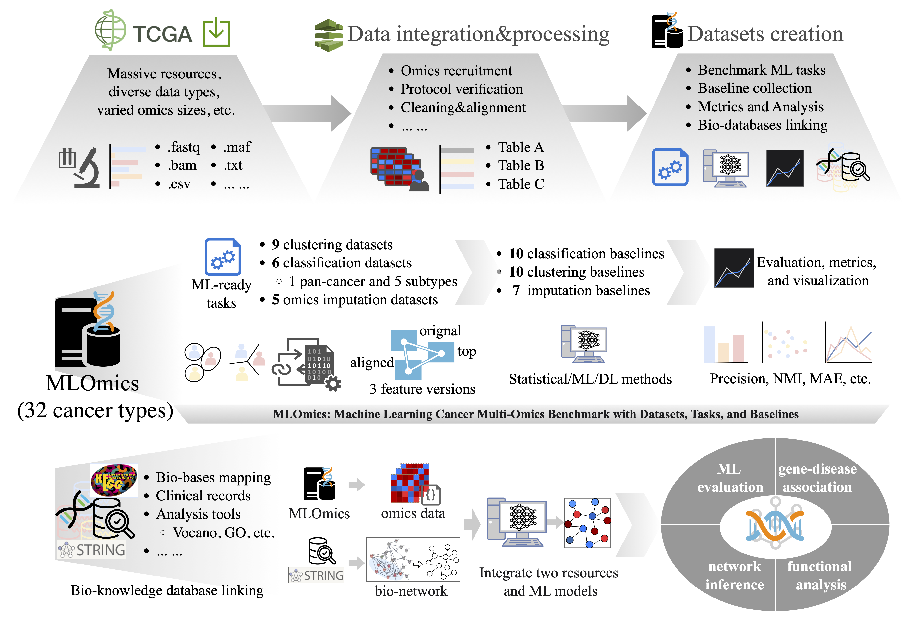
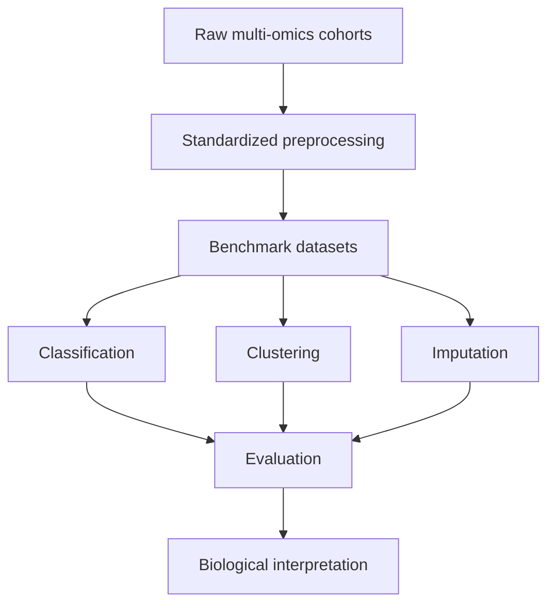

<div align="center">

</div>

# MLOmics: Cancer Multi-Omics Database for Machine Learning

**A standardized benchmark and toolkit for cancer multi-omics machine learning.**

| Datasets | Cancer types | Patients | Omics | Baselines | Venue |
|:---:|:---:|:---:|:---:|:---:|:---:|
| **20** | **32** | **8,314** | **4** (mRNA, miRNA, Methy, CNV) | **10+** | [Scientific Data](https://www.nature.com/articles/s41597-025-05235-x) |

[Paper](https://www.nature.com/articles/s41597-025-05235-x) · [Project Page](https://chenzrg.github.io/project/mlomics) · [Hugging Face](https://huggingface.co/datasets/AIBIC/MLOmics)

-------------------

📢 **Update (July 2026):** MLOmics resources have been refreshed based on community feedback. Thank you to everyone who shared suggestions.

-------------------

## Highlights

- Standardized benchmark datasets for cancer multi-omics learning
- Unified preprocessing with Original / Top / Aligned feature scales
- Ready-to-run classical and deep baseline implementations
- Reproducible evaluation protocols (PREC, NMI, ARI, SIL, LPS, MAE, RMSE)
- Biological downstream analysis utilities (survival, enrichment, knowledge linking)
- Public datasets, documentation, and unified runners under `scripts/`

---

## Workflow


```mermaid
flowchart TD
    A[Raw multi-omics cohorts] --> B[Standardized preprocessing]
    B --> C[Benchmark datasets]
    C --> D[Classification]
    C --> E[Clustering]
    C --> F[Imputation]
    D --> G[Evaluation]
    E --> G
    F --> G
    G --> H[Biological interpretation]
```

---

## Table of Contents

- [Installation](#installation)
- [Quick Start](#quick-start)
- [Benchmark Tasks](#benchmark-tasks)
- [Performance Leaderboards](#performance-leaderboards)
- [Resources](#resources)
- [Citation](#citation)

---

## Installation

```bash
git clone https://github.com/chenzRG/Cancer-Multi-Omics-Benchmark
cd Cancer-Multi-Omics-Benchmark

conda create -n mlomics python=3.11
conda activate mlomics
pip install -r requirements.txt

# Requires git-lfs
./download.sh
```

> Deep baselines (e.g., MAUI) may need extra packages; see notes in `requirements.txt`.

---

## Quick Start

Run your first benchmark in under one minute (lightweight classical baseline):

```bash
./scripts/run_classification.sh \
  --dataset GS-BRCA \
  --version Top \
  --method XGBoost
```

Unified interface for other tasks:

```bash
./scripts/run_<task>.sh --dataset <dataset> --version <version> [options]
```

| Task | Example |
|------|---------|
| Classification | `./scripts/run_classification.sh --dataset GS-BRCA --version Top --method XGBoost` |
| Clustering | `./scripts/run_clustering.sh --dataset ACC --version Top --method SNF --k 3` |
| Imputation | `./scripts/run_imputation.sh --dataset Imp-BRCA --omics mRNA --method GAIN --missing 0.3` |

Direct model scripts also work under `scripts/Classification`, `scripts/Clustering`, and `scripts/Imputation`.

**Downstream analysis**

```bash
python Auxiliary_Resource/Analysis_tools/Analysis_Tools.py \
  --clustering_log <clustering_log_path> \
  --p_value_cutoff 0.05
```

---

## Benchmark Tasks

```text
Classification
├── Pan-cancer          → identify cancer type
└── Molecular subtype   → GS-BRCA / GS-COAD / GS-GBM / GS-LGG / GS-OV
                          metrics: PREC, NMI, ARI

Clustering
├── 9 cancer cohorts    → ACC, KIRP, KIRC, LIHC, LUAD, LUSC, PRAD, THCA, THYM
└── Survival evaluation → SIL, LPS

Imputation
├── Five datasets       → Imp-BRCA / Imp-COAD / Imp-GBM / Imp-LGG / Imp-OV
└── Missing rates       → 0.3 / 0.5 / 0.7
                          metrics: MAE, RMSE
```

Complementary resources: STRING / KEGG mappings, clinical annotations, and integration scripts under `Auxiliary_Resource/`.

| Category | Datasets |
|----------|----------|
| Pan-cancer classification (1) | Pan-cancer |
| Golden-standard subtype classification (5) | GS-BRCA, GS-COAD, GS-GBM, GS-LGG, GS-OV |
| Cancer subtype clustering (9) | ACC, KIRP, KIRC, LIHC, LUAD, LUSC, PRAD, THCA, THYM |
| Omics imputation (5) | Imp-BRCA, Imp-COAD, Imp-GBM, Imp-LGG, Imp-OV |

---

## Feature Scales

| Scale | Description |
|-------|-------------|
| **Original** | Full feature set without filtering; suitable for custom pipelines |
| **Top** | ANOVA-selected top features (unified sizes; reduces noise) |
| **Aligned** | Intersection of features shared across related sub-datasets |

---

## Repository Structure

```text
MLOmics/
├── Main_Dataset/                 # Downloaded separately via ./download.sh
├── Baseline_and_Metric/          # Baselines + evaluation metrics
│   ├── Classification/
│   ├── Clustering/
│   └── Imputation/
├── Auxiliary_Resource/           # Knowledge bases, clinical data, analysis tools
├── scripts/                      # Unified runners (run_*.sh) and per-model scripts
├── utils/data_loader.py          # Shared MLOmics data loader
├── download.sh
└── requirements.txt
```

---

## Performance Leaderboards

We provide reproducible benchmark results across supported datasets using representative classical and deep learning baselines. These tables are reference points for comparison, not an exhaustive SOTA contest.

<details>
<summary><strong>Classification results</strong> (PREC / NMI / ARI — click to expand)</summary>

<br>

| Method         | Pan-cancer PREC | Pan-cancer NMI | Pan-cancer ARI | GS-BRCA PREC | GS-BRCA NMI | GS-BRCA ARI | GS-COAD PREC | GS-COAD NMI | GS-COAD ARI | GS-GBM PREC | GS-GBM NMI | GS-GBM ARI |
|----------------|-----------------|----------------|----------------|--------------|-------------|-------------|--------------|-------------|-------------|-------------|------------|------------|
| SNF            | 0.643           | 0.543          | 0.475          | 0.644        | 0.523       | 0.426       | 0.625        | 0.534       | 0.432       | 0.625       | 0.544      | 0.470      |
| NEMO           | 0.656           | 0.464          | 0.356          | 0.542        | 0.444       | 0.333       | 0.644        | 0.454       | 0.333       | 0.634       | 0.406      | 0.316      |
| CIMLR          | 0.665           | 0.365          | 0.344          | 0.655        | 0.332       | 0.345       | 0.631        | 0.343       | 0.344       | 0.647       | 0.344      | 0.323      |
| iClusterBayes  | 0.747           | 0.534          | 0.433          | 0.646        | 0.524       | 0.428       | 0.637        | 0.582       | 0.434       | 0.662       | 0.506      | 0.432      |
| moCluster      | 0.725           | 0.553          | 0.557          | 0.636        | 0.630       | 0.655       | 0.749        | 0.546       | 0.652       | 0.755       | 0.734      | 0.564      |
| Subtype-GAN    | 0.844           | 0.774          | 0.748          | 0.873        | 0.734       | 0.643       | 0.851        | 0.685       | 0.648       | 0.837       | 0.625      | 0.640      |
| DCAP           | 0.845           | 0.745          | 0.636          | 0.852        | 0.743       | 0.733       | 0.852        | 0.667       | 0.655       | 0.825       | 0.642      | 0.522      |
| MAUI           | 0.859           | 0.758          | 0.625          | 0.844        | 0.792       | 0.742       | 0.882        | 0.635       | 0.696       | 0.874       | 0.741      | 0.691      |
| XOmiVAE        | 0.894           | 0.795          | 0.774          | 0.843        | 0.753       | 0.761       | 0.923        | 0.752       | 0.732       | 0.946       | 0.791      | 0.737      |
| MCluster-VAEs  | 0.883           | 0.776          | 0.763          | 0.852        | 0.784       | 0.766       | 0.895        | 0.743       | 0.727       | 0.913       | 0.783      | 0.718      |

</details>

<details>
<summary><strong>Imputation results</strong> (RMSE / MAE at 70% / 50% / 30% missing — click to expand)</summary>

<br>

| Data | Missing Rate | Mean RMSE | Mean MAE | KNN RMSE | KNN MAE | MICE RMSE | MICE MAE | SVD RMSE | SVD MAE | SPEC RMSE | SPEC MAE | GRAPE RMSE | GRAPE MAE | GAIN RMSE | GAIN MAE |
|------|--------------|-----------|----------|----------|---------|-----------|----------|----------|---------|-----------|----------|------------|-----------|-----------|----------|
| BRCA | 70%          | 0.119     | 0.092    | 0.109    | 0.081   | 0.106     | 0.079    | 0.099    | 0.076   | 0.104     | 0.076    | 0.127      | 0.099     | 0.117     | 0.089    |
| BRCA | 50%          | 0.119     | 0.092    | 0.103    | 0.075   | 0.090     | 0.066    | 0.086    | 0.063   | 0.090     | 0.063    | 0.131      | 0.101     | 0.114     | 0.087    |
| BRCA | 30%          | 0.119     | 0.092    | 0.099    | 0.075   | 0.084     | 0.062    | 0.080    | 0.058   | 0.088     | 0.058    | 0.131      | 0.102     | 0.112     | 0.085    |
| COAD | 70%          | 0.101     | 0.077    | 0.099    | 0.073   | 0.093     | 0.068    | 0.089    | 0.067   | 0.094     | 0.069    | 0.102      | 0.077     | 0.104     | 0.079    |
| COAD | 50%          | 0.101     | 0.077    | 0.091    | 0.066   | 0.079     | 0.058    | 0.077    | 0.057   | 0.076     | 0.055    | 0.110      | 0.075     | 0.103     | 0.079    |
| COAD | 30%          | 0.102     | 0.077    | 0.086    | 0.063   | 0.076     | 0.056    | 0.072    | 0.053   | 0.071     | 0.051    | 0.105      | 0.070     | 0.103     | 0.078    |
| GBM  | 70%          | 0.122     | 0.096    | 0.106    | 0.080   | 0.097     | 0.073    | 0.096    | 0.074   | 0.110     | 0.084    | 0.125      | 0.117     | 0.122     | 0.095    |
| GBM  | 50%          | 0.122     | 0.096    | 0.097    | 0.073   | 0.084     | 0.063    | 0.082    | 0.063   | 0.084     | 0.061    | 0.145      | 0.116     | 0.115     | 0.089    |
| GBM  | 30%          | 0.122     | 0.096    | 0.093    | 0.070   | 0.080     | 0.060    | 0.078    | 0.062   | 0.083     | 0.058    | 0.146      | 0.117     | 0.114     | 0.088    |
| LGG  | 70%          | 0.131     | 0.104    | 0.109    | 0.083   | 0.095     | 0.072    | 0.097    | 0.074   | 0.153     | 0.124    | 0.152      | 0.123     | 0.132     | 0.095    |
| LGG  | 50%          | 0.131     | 0.103    | 0.098    | 0.074   | 0.082     | 0.061    | 0.081    | 0.061   | 0.082     | 0.062    | 0.151      | 0.123     | 0.129     | 0.102    |
| LGG  | 30%          | 0.131     | 0.103    | 0.094    | 0.071   | 0.078     | 0.058    | 0.076    | 0.057   | 0.074     | 0.056    | 0.151      | 0.123     | 0.123     | 0.097    |
| OV   | 70%          | 0.124     | 0.098    | 0.122    | 0.094   | 0.118     | 0.091    | 0.112    | 0.088   | 0.161     | 0.130    | 0.127      | 0.101     | 0.126     | 0.099    |
| OV   | 50%          | 0.124     | 0.098    | 0.109    | 0.083   | 0.102     | 0.078    | 0.100    | 0.075   | 0.098     | 0.078    | 0.126      | 0.099     | 0.125     | 0.098    |
| OV   | 30%          | 0.124     | 0.098    | 0.103    | 0.078   | 0.098     | 0.075    | 0.093    | 0.071   | 0.090     | 0.069    | 0.126      | 0.099     | 0.124     | 0.097    |

</details>

---

## Cancer Type Abbreviations

<details>
<summary><strong>32 cancer type abbreviations</strong> (click to expand)</summary>

<br>

| No. | Full Name | Abbreviation |
|-----|-----------|--------------|
| 1 | Acute Myeloid Leukemia | LAML |
| 2 | Adrenocortical Cancer | ACC |
| 3 | Bladder Urothelial Carcinoma | BLCA |
| 4 | Brain Lower Grade Glioma | LGG |
| 5 | Breast Invasive Carcinoma | BRCA |
| 6 | Cervical & Endocervical Cancer | CESC |
| 7 | Cholangiocarcinoma | CHOL |
| 8 | Colon Adenocarcinoma | COAD |
| 9 | Diffuse Large B-cell Lymphoma | DLBC |
| 10 | Esophageal Carcinoma | ESCA |
| 11 | Head & Neck Squamous Cell Carcinoma | HNSC |
| 12 | Kidney Chromophobe | KICH |
| 13 | Kidney Clear Cell Carcinoma | KIRC |
| 14 | Kidney Papillary Cell Carcinoma | KIRP |
| 15 | Liver Hepatocellular Carcinoma | LIHC |
| 16 | Lung Adenocarcinoma | LUAD |
| 17 | Lung Squamous Cell Carcinoma | LUSC |
| 18 | Mesothelioma | MESO |
| 19 | Ovarian Serous Cystadenocarcinoma | OV |
| 20 | Pancreatic Adenocarcinoma | PAAD |
| 21 | Pheochromocytoma & Paraganglioma | PCPG |
| 22 | Prostate Adenocarcinoma | PRAD |
| 23 | Rectum Adenocarcinoma | READ |
| 24 | Sarcoma | SARC |
| 25 | Skin Cutaneous Melanoma | SKCM |
| 26 | Stomach Adenocarcinoma | STAD |
| 27 | Testicular Germ Cell Tumor | TGCT |
| 28 | Thymoma | THYM |
| 29 | Thyroid Carcinoma | THCA |
| 30 | Uterine Carcinosarcoma | UCS |
| 31 | Uterine Corpus Endometrioid Carcinoma | UCEC |
| 32 | Uveal Melanoma | UVM |

</details>

---

## Dataset Feature Dimensions

<details>
<summary><strong>Feature dimensions by dataset / scale</strong> (click to expand)</summary>

<br>

| Dataset | Feature Scale | mRNA | miRNA | Methy | CNV |
|---------|---------------|------|-------|-------|-----|
| ACC | Original | 18034 | 368 | 18711 | 19519 |
| | Aligned | 10452 | 254 | 10347 | 10154 |
| | Top | 5000 | 200 | 5000 | 5000 |
| KIRP | Original | 17254 | 375 | 18715 | 19532 |
| | Aligned | 10452 | 254 | 10347 | 10154 |
| | Top | 5000 | 200 | 5000 | 5000 |
| KIRC | Original | 18464 | 352 | 19045 | 19523 |
| | Aligned | 10452 | 254 | 10347 | 10154 |
| | Top | 5000 | 200 | 5000 | 5000 |
| LIHC | Original | 17945 | 435 | 18714 | 19523 |
| | Aligned | 10452 | 254 | 10347 | 10154 |
| | Top | 5000 | 200 | 5000 | 5000 |
| LUAD | Original | 18303 | 427 | 19034 | 19532 |
| | Aligned | 10452 | 254 | 10347 | 10154 |
| | Top | 5000 | 200 | 5000 | 5000 |
| LUSC | Original | 18577 | 423 | 19025 | 19543 |
| | Aligned | 10452 | 254 | 10347 | 10154 |
| | Top | 5000 | 200 | 5000 | 5000 |
| PRAD | Original | 17948 | 447 | 19028 | 19528 |
| | Aligned | 10452 | 254 | 10347 | 10154 |
| | Top | 5000 | 200 | 5000 | 5000 |
| THCA | Original | 17261 | 345 | 19024 | 19532 |
| | Aligned | 10452 | 254 | 10347 | 10154 |
| | Top | 5000 | 200 | 5000 | 5000 |
| THYM | Original | 18341 | 535 | 18716 | 19532 |
| | Aligned | 10452 | 254 | 10347 | 10154 |
| | Top | 5000 | 200 | 5000 | 5000 |
| GS-COAD | Original | 17261 | 375 | 19023 | 19545 |
| | Aligned | 11343 | 286 | 11189 | 11203 |
| | Top | 5000 | 200 | 5000 | 5000 |
| GS-BRCA | Original | 18206 | 345 | 19049 | 19533 |
| | Aligned | 11343 | 286 | 11189 | 11203 |
| | Top | 5000 | 200 | 5000 | 5000 |
| GS-GBM | Original | 17539 | 308 | 19031 | 19539 |
| | Aligned | 11343 | 286 | 11189 | 11203 |
| | Top | 5000 | 200 | 5000 | 5000 |
| GS-LGG | Original | 18339 | 321 | 19017 | 19528 |
| | Aligned | 11343 | 286 | 11189 | 11203 |
| | Top | 5000 | 200 | 5000 | 5000 |
| GS-OV | Original | 17344 | 244 | 19031 | 19528 |
| | Aligned | 11343 | 286 | 11189 | 11203 |
| | Top | 5000 | 200 | 5000 | 5000 |
| Pan-cancer | Original | 3217 | 383 | 3139 | 3105 |
| Imp-BRCA | Top | 5000 | 200 | 5000 | 5000 |
| Imp-COAD | Top | 5000 | 200 | 5000 | 5000 |
| Imp-GBM | Top | 5000 | 200 | 5000 | 5000 |
| Imp-LGG | Top | 5000 | 200 | 5000 | 5000 |
| Imp-OV | Top | 5000 | 200 | 5000 | 5000 |

</details>

---

## Tasks and Baselines (Details)

### Classification and clustering baselines

Shared multi-omics baselines include SNF [1], NEMO [2], CIMLR [3], iClusterBayes [4], moCluster [5], Subtype-GAN [6], DCAP [7], MAUI [8], XOmiVAE [9], and MCluster-VAEs [10].

| Task | #Baselines | Metrics |
|------|------------|---------|
| Pan-cancer classification | 10 | PREC, NMI, ARI |
| Golden-standard subtype classification | 10 | PREC, NMI, ARI |
| Cancer subtype clustering | 10 | SIL, LPS |

### Imputation baselines

Mean [11], KNN [12], MICE [13], Iterative SVD [14], Spectral [15], GRAPE [16], GAIN [17].

| Task | #Baselines | Metrics |
|------|------------|---------|
| Omics data imputation | 7 | MAE, RMSE |

---

## Resources

- [Paper (Scientific Data)](https://www.nature.com/articles/s41597-025-05235-x)
- [Project website](https://chenzrg.github.io/project/mlomics)
- [Hugging Face dataset](https://huggingface.co/datasets/AIBIC/MLOmics)
- Documentation: this README + `scripts/` runners + `utils/data_loader.py`
- Citation: see below

---

## Citation

If you find MLOmics useful, please cite:

```bibtex
@article{2025mlomics,
  title={MLOmics: Cancer Multi-Omics Database for Machine Learning},
  author={Yang, Ziwei and Kotoge, Rikuto and Piao, Xihao and Chen, Zheng and Zhu, Lingwei and Gao, Peng and Matsubara, Yasuko and Sakurai, Yasushi and Sun, Jimeng},
  journal={Scientific Data},
  volume={12},
  number={1},
  pages={1--9},
  year={2025},
  publisher={Nature Publishing Group}
}
```

---

## References

[1] [Bo Wang et al. Similarity network fusion for aggregating data types on a genomic scale. Nature methods, 2014.](https://www.nature.com/articles/nmeth.2810)

[2] [Nimrod Rappoport and Ron Shamir. Nemo: cancer subtyping by integration of partial multiomic data. Bioinformatics, 2019.](https://academic.oup.com/bioinformatics/article/35/18/3348/5304361)

[3] [Christopher M Wilson et al. Multiple-kernel learning for genomic data mining and prediction. BMC bioinformatics, 2019.](https://bmcbioinformatics.biomedcentral.com/articles/10.1186/s12859-019-2992-1)

[4] [Qianxing Mo et al. A fully bayesian latent variable model for integrative clustering analysis of multi-type omics data. Biostatistics, 2018.](https://academic.oup.com/biostatistics/article/19/1/71/3852318)

[5] [Chen Meng et al. mocluster: identifying joint patterns across multiple omics data sets. Journal of proteome research, 2016.](https://pubs.acs.org/doi/10.1021/acs.jproteome.5b00824)

[6] [Hai Yang et al. Subtype-gan: a deep learning approach for integrative cancer subtyping of multi-omics data. Bioinformatics, 2021.](https://academic.oup.com/bioinformatics/article/37/16/2231/6143031)

[7] [Hua Chai et al. Integrating multi-omics data through deep learning for accurate cancer prognosis prediction. Computers in biology and medicine, 2021.](https://www.sciencedirect.com/science/article/pii/S0010482521002754)

[8] [Jonathan Ronen et al. Evaluation of colorectal cancer subtypes and cell lines using deep learning. Life science alliance, 2019.](https://www.life-science-alliance.org/content/2/6/e201900517)

[9] [Eloise Withnell et al. Xomivae: an interpretable deep learning model for cancer classification using high-dimensional omics data. Briefings in bioinformatics, 2021.](https://academic.oup.com/bib/article/22/6/bbab315/6353242)

[10] [Zhiwei Rong et al. Mclustervaes: an end-to-end variational deep learning-based clustering method for subtype discovery using multi-omics data. Computers in Biology and Medicine, 2022.](https://www.sciencedirect.com/science/article/pii/S0010482522007934?via%3Dihub)

[11] [Donders et al. Review: A gentle introduction to imputation of missing values. Journal of Clinical Epidemiology, 2006.](https://www.sciencedirect.com/science/article/pii/S0895435606001971)

[12] [Olga Troyanskaya et al. Missing value estimation methods for DNA microarrays. Bioinformatics, 2001.](https://academic.oup.com/bioinformatics/article/17/6/520/272365)

[13] [Stef van Buuren and Karin Groothuis-Oudshoorn. mice: Multivariate imputation by chained equations in R. Journal of Statistical Software, 2011.](https://www.jstatsoft.org/article/view/v045i03)

[14] [Trevor Hastie et al. Matrix completion and low-rank SVD via fast alternating least squares. Journal of Machine Learning Research, 2015.](https://jmlr.org/papers/v16/hastie15a.html)

[15] [Rahul Mazumder et al. Spectral regularization algorithms for learning large incomplete matrices. Journal of Machine Learning Research, 2010.](https://jmlr.org/papers/v11/mazumder10a.html)

[16] [Jiaxuan You et al. Handling missing data with graph representation learning. NeurIPS, 2020.](https://proceedings.neurips.cc/paper/2020/hash/dc36f18a9a0a776671d4879cae69b551-Abstract.html)

[17] [Jinsung Yoon et al. GAIN: Missing data imputation using generative adversarial nets. ICML, 2018.](https://proceedings.mlr.press/v80/yoon18a.html)
